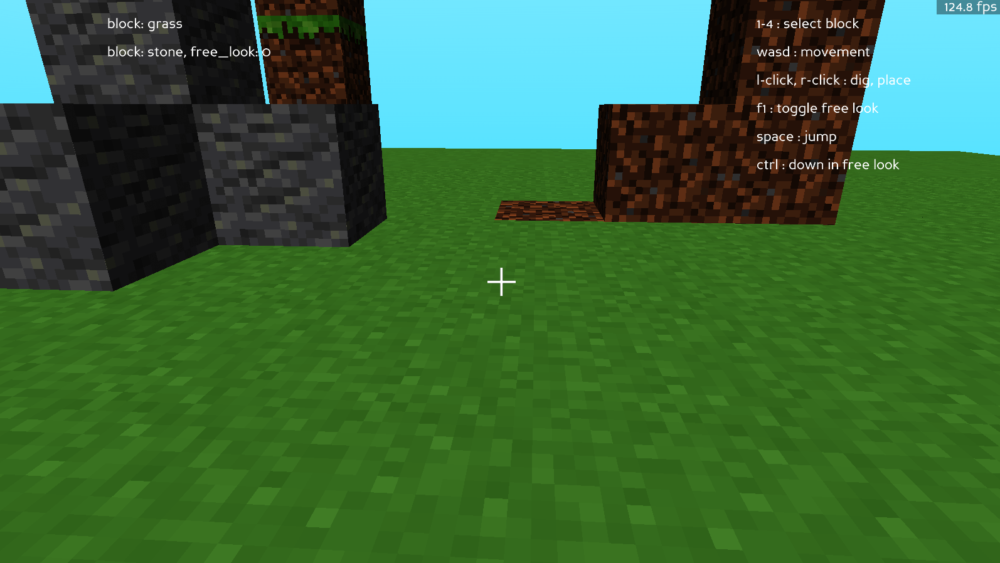
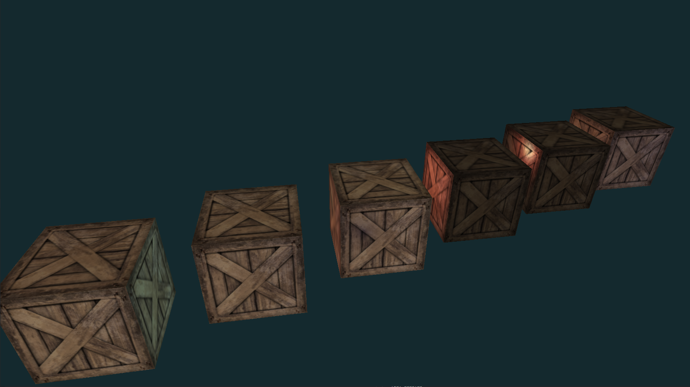

# Python 3D Engines

An exploration of 3D engines and rendering in Python.

All projects are working with Python 3.12.

## ./p3d - Panda3D First Person Test

My first test in Panda3D following the basic tutorial for minecraft style block rendering from <https://www.youtube.com/watch?v=xV3gH1JZew4>.

We load in textured block meshes from **.glb** model files, create a simple grid, add a skybox, and have simple camera with movement and controls to dig or place blocks with Ray collision detection.

I added better camera controls and some collision detection for the 'camera' player in my example.

To install use `pip install -r requirements.txt` to fetch the following packages:

- panda3d==1.10.14
- types-panda3d==0.4.1
- panda3d-gltf==1.1.0

To run the example use `python main.py` from any of the project directories.

Need to add:

- More efficient collision objects traversal, by deactivating the ones that are far away. This seems to be the main bottleneck in the game loop in Panda3D.
- In fact just chuck out the collision system and use a better one that isn't so convoluted. See `coll_panda.py` for a simple example with a physics pusher and see how complicated this is.
- Figure out why Panda3D dt is so bad at staying smooth, it doesn't seem correct to me.
- Needs shadows, pbr lighting.

## ./mgl - ModernGL and Pygame First Person Test

My first test with ModernGL following this tutorial <https://www.youtube.com/watch?app=desktop&v=eJDIsFJN4OQ>.

We create an entire 3D renderer from scratch using ModernGL and Pygame. We load in a simple textured cube and have a first person camera with movement and controls. This example also loads a model file with texture mapping.

I refactor the code and and working on psychics and collision detection.

To install use `pip install -r requirements.txt` to fetch the following packages:

- moderngl==5.11.1
- pygame==2.6.0
- PyGLM==2.7.1
- numba==0.60.0
- numpy==1.26.3
- opensimplex==0.4.5.1
- pywavefront==1.3.3

To run the example use `python main.py` from any of the project directories.

Need to add:

- Collision detection and Physics.
- Skeletal animation.
- Correct the PBR model to have values per material, not per light.
- Other light sources.
- Need to figure out how to draw text to the screen or if it is possible to render on the PyGame layer while using ModernGL.
- Loading more model types (blender, gltf, etc).
