# Python 3D Rendering Engines

An exploration of 3D engines and rendering in Python by `Nokota Mustang`.

Computer graphics is a vast field, and I am interested in learning more about the rendering process and the mathematics behind it. Having a good grasp of realtime graphics, data structures, and algorithms is essential for game development, simulations, and visualizations. I've completed 2D game projects before, but I want to learn more about 3D graphics and rendering.

There is a lot of crossover to modern App development, and the skills learned here can be applied to AR/VR, simulations, and data visualization. In addition data processing and machine learning can benefit from the parallel processing capabilities of the GPU; so learning about graphics rendering is a good investment of time.

Opengl is a low-level graphics API that can be used to create 3D graphics, but it is quite complex and requires a lot of boilerplate code to get started. ModernGL is a Python wrapper around OpenGL that simplifies the process of creating 3D graphics.

There are several very large and detail books about graphics rendering, but when it comes to creating real-time graphics with interactive applications, there is a complex balance between performance and quality.

This means there are several ideas and solutions to some of the same problems, but the issue becomes how to combine multiple techniques to create a coherent and efficient system.

In the case if Disney's Panda3D, it is a game engine that simplifies the process of creating 3D games with c++ or Python. However usually when exploring a game engine, the low level rendering process is abstracted away, and an assortment of tools and features are provided, which also sometimes carries code-bloat and performance overhead. The bigger the engine, the more features and tools are available, but the more complex and harder to learn it becomes; such in the case of Unity or Unreal Engine 4 or 5.

Therefore to learn how to approach graphics from a first-principles perspective, I will be exploring Python based rendering engines. Why Python? Because it is a high-level language that is easy to learn and use, and it is also a language that I am familiar with and it's one of the most powerful and popular tools out there today. I also have a series that will explore c++ with Vulkan, but that is a different story.

How to use this repository? Each project is a standalone example of a 3D rendering technique or feature. Some projects are combined to create a more complex scene. Each project is a self-contained example that can be run independently. All projects are working with Python 3.12.

## mgl - ModernGL and Pygame 3D demonstrations

ModernGL wraps OpenGL in Python and simplifies the process of creating 3D graphics. Pygame is a set of Python modules designed for writing video games. It includes computer graphics and sound libraries designed to be used with the Python programming language. This makes a perfect pair of libraries to create 3D graphics in Python. I will build a series of examples using ModernGL and Pygame to explore 3D rendering techniques, and eventually combine them to create a 3D game engine.

To install use `pip install -r requirements.txt` to fetch the following packages:

-   moderngl==5.11.1
-   moderngl_window==2.4.6
-   pygame==2.6.0
-   pygame_menu==4.4.3
-   PyGLM==2.7.1
-   numba==0.60.0
-   numpy==1.26.3
-   opensimplex==0.4.5.1
-   perlin_noise==1.13
-   pywavefront==1.3.3

To run an example use `python main.py` from any of the project sub-directories.

General keys in the examples:

-   `ESC` - Exit
-   `F1` - Pause time / Resume time
-   `F3` - Toggle view of wire-frames
-   `F11` - Toggle full screen
-   `WASD` - [Forward, Left, Backward, Right] flying camera movement
-   `Mouse Move` - camera look movement

### mgl/cube - Cube with Lambert Diffusion & Blinn-Phong Specular lighting

Create a 3D cube from vertices, indices, and normals, and apply a simple lighting shader to it.

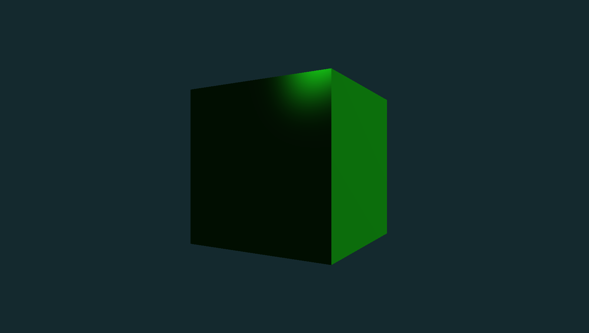

This is a basic example creating a 3D mesh from scratch and applying a simple shader program to it. The shader program is a combination of Lambert Diffusion and Blinn-Phong Specular lighting models.

Because we communicate with the GPU using OpenGL under the hood, we need to send data to the GPU in the form of buffers. We create a Vertex Buffer Object (VBO) to store the vertices, and an Element Buffer Object (EBO) to store the indices of the vertices that make up the triangles of the cube.

The shader program is a combination of a vertex shader and a fragment shader. The vertex shader is responsible for transforming the vertices of the cube into screen space, and the fragment shader is responsible for calculating the color of each pixel on the cube. These shaders are written in GLSL (OpenGL Shading Language) and operate in parallel on the GPU via thousands shader cores.

Therefore learning to write code in parallel is essential for creating efficient graphics applications.

### mgl/cube_2 - Anti-aliasing

Added anti-aliasing with a sized up render buffer with 4 samples.

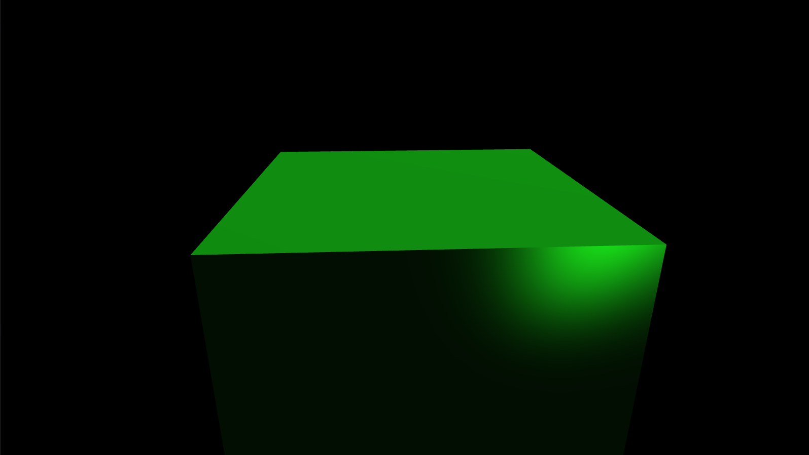

The basic principle of anti-aliasing is to render the scene at a higher resolution and then down-sample it to the screen resolution. This is done by rendering the scene to a render buffer with a higher resolution than the screen, and then down-sampling it to the screen resolution using a shader program.

Without anti-aliasing, the edges of the cube appear jagged because the pixels on the screen are square and the edges of the cube are not aligned with the pixels. Anti-aliasing smooths out the edges of the cube by blending the colors of the pixels along the edges.

### mgl/cubes - Cubes + textures

Adding more cubes to the scene with texture mapping and multiple light sources.

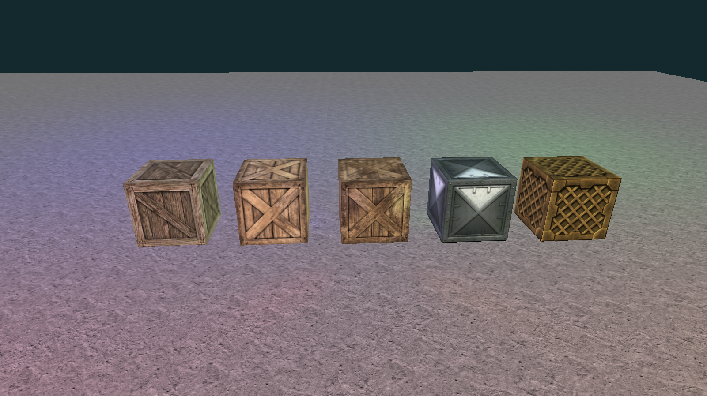

This example adds more cubes to the scene and applies a texture to each cube. The texture is a 2D image that is mapped to the surface of the cube using texture coordinates. The texture coordinates are stored in the VBO along with the vertices of the cube.

With basic illumination applied in addition to the texture the scene is starting to look more realistic. The floor is a grid of cubes to illustrate how to create a large scene with many objects. However, this is usually considered inefficient because each cube is a separate draw call to the GPU; whereas for a floor only the top faces of the cubes are visible. More on this later.

### mgl/cubes_2 - Cubes + textures + shadows

A Shadow casting system is added to the cubes demo; this example also re-uses shaders and therefore shader program values are set for each object before rendering.

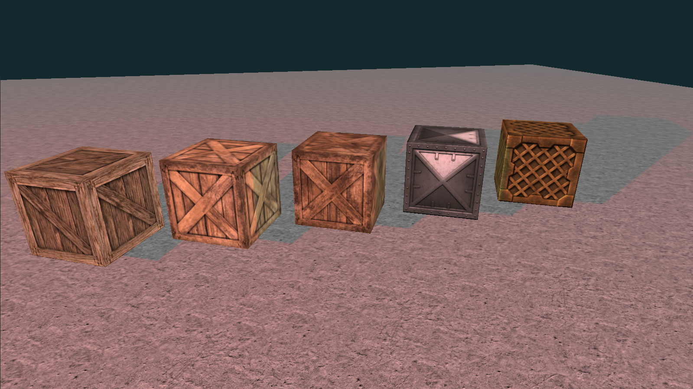
_Note the cubes are floating, not sitting on the ground._

A two pass rendering system is used to create shadows in the scene. The first pass renders the scene from the perspective of the light source to create a shadow map. The second pass renders the scene from the perspective of the camera and uses the shadow map to determine if a pixel is in shadow or not.

A shadow map is a depth buffer that is rendered from the perspective of the light source. The depth buffer is then used to determine if a pixel on the cube is in shadow or not. If the pixel is in shadow, it is darkened; if it is not in shadow, it is illuminated.

OpenGL is efficient and has some tools that compute some of these factors on the GPU, and we can use the shader program to calculate the state of a pixel, whether it is in shadow or not.

In an ideal situation, we would send all data in matrices to the shader, and then render all objects in one go with minimal value changes to the shader program.

Additionally, this uses a single shadow map for all objects in the scene i.e. only one light direction is modelled. Some changes are needed to support shadows from multiple light sources.

### mgl/simple_scene - Combining simple features

The basic example use ModernGL following this tutorial from 'Coder Space': <https://www.youtube.com/watch?app=desktop&v=eJDIsFJN4OQ>. I've expanded on this adding more features, see below for the examples.

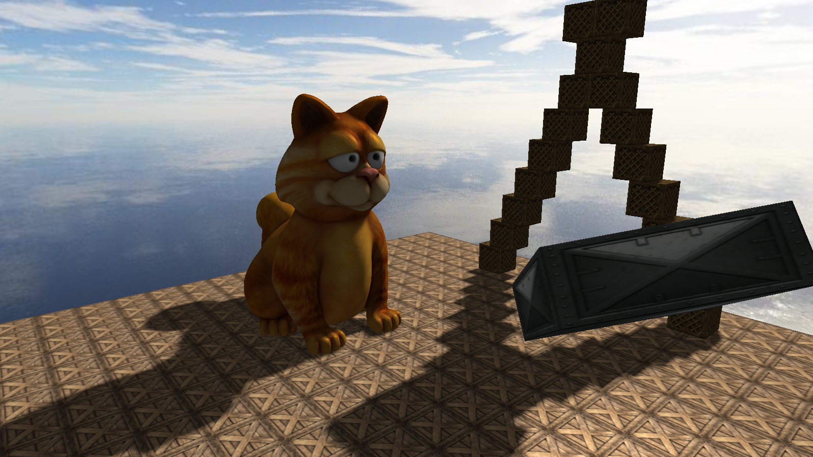

Using textured cubes, shader programs, skybox, lighting and shadows. This is the same as the original example from the tutorial, but refactored and I've added some object culling.

This project is useful to highlight reuse of assets and resources in ModernGL. So the class structure and caching of resources is important to reduce memory usage and improve rendering performance.

### mgl/pbr - Physically based rendering

Physically Based Rendering (PBR) is a rendering technique that simulates the way light interacts with materials in the real world. It is based on the physics of light and materials, and it is used to create realistic lighting and shading effects in 3D graphics.

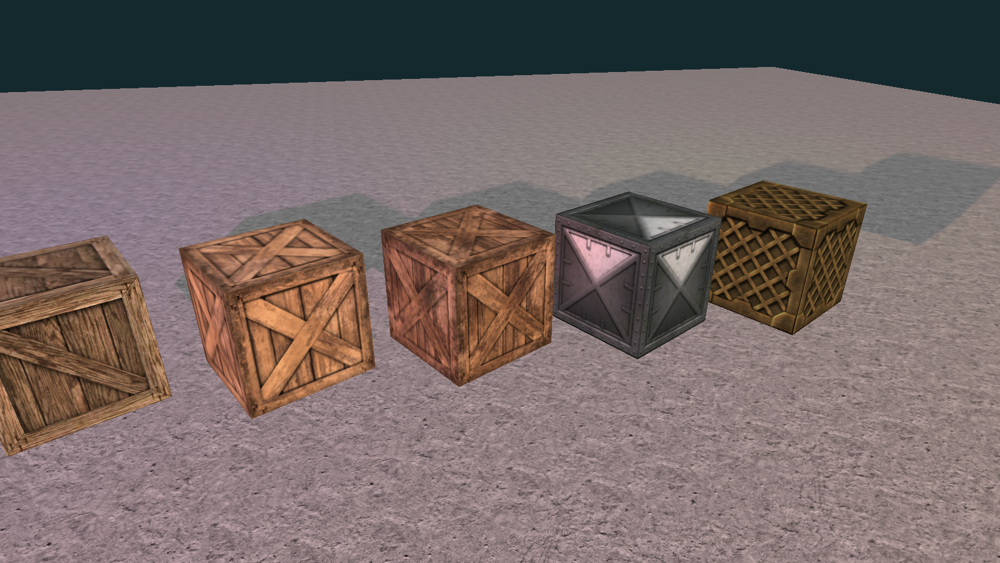

The basic idea behind PBR is to use physically accurate models to simulate the way light interacts with materials. This includes models for diffuse reflection, specular reflection, and transmission. These models are based on the physical properties of materials, such as their reflectance, roughness, and index of refraction.

Therefore each material has a set of properties that describe how it interacts with light. These properties include the albedo, roughness, and metallic value. The albedo is the base color of the material, the roughness is how rough or smooth the material is, the metallic is how metallic or non-metallic the material is, and the normal map is a texture that simulates surface detail.

We can assign these properties to each cube in the scene, and then use a PBR shader to render the cubes with realistic lighting and shading effects. The PBR shader uses the properties of the material to calculate the color of each pixel on the cube, with the properties of the light sources in the scene and produces a more realistic effect as the light interacts with the material.

### mgl/grass - Grass rendering

As we have explored shader programs and how they can be used to render 3D objects, we can use them to render more complex objects such as grass. Grass in complex scenes isn't modelled from a 3D mesh, but rather a series of 2D planes called 'billboards'.

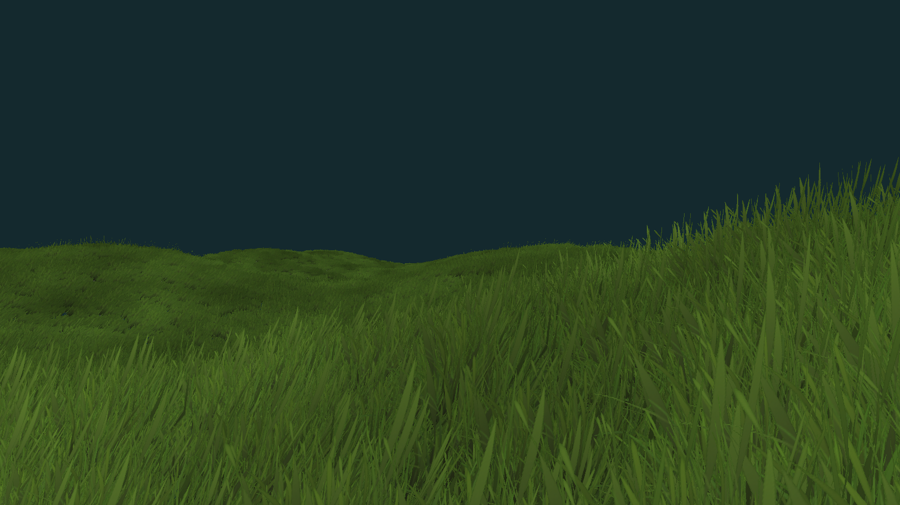

Starting from the tutorial: <https://vulpinii.github.io/tutorials/grass-modelisation/en/> and <https://developer.nvidia.com/gpugems/gpugems/part-i-natural-effects/chapter-7-rendering-countless-blades-waving-grass>.

This is a common technique in games to render large amounts of grass efficiently, since we can send a vector of points to what is called a 'geometry shader', and this in turn can create all the billboards around each point, then passed to the fragment shader to render hte grass texture on the billboards.

Part of the amazing quality of parallel processing on the GPU is that we can simulate wind movement on the grass using a 'flow map'. This is a 2D texture that is used to simulate the movement of the grass in the wind. The flow map is used to offset the position of the grass in the geometry shader, and this creates the effect of the grass moving in the wind.

Some more info on flow maps: <https://github.com/JaccomoLorenz/godot-flow-map-shader>

### mgl/grass_2 - Grass rendering from a texture atlas

Expanding on the grass rendering to use a texture atlas for the grass models.

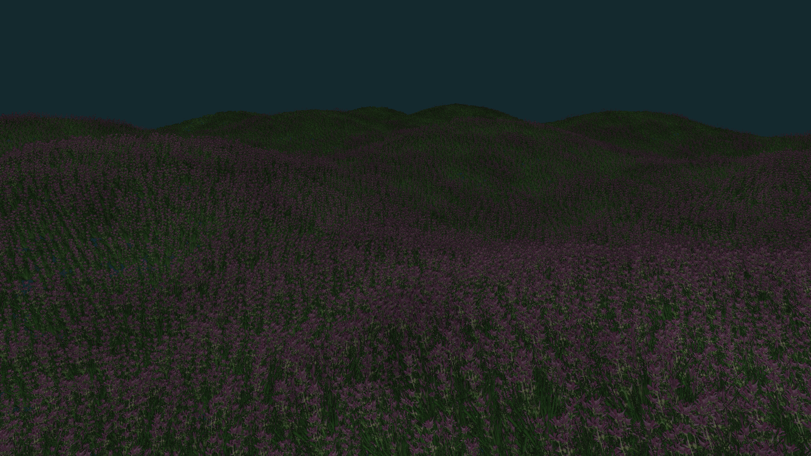

A texture atlas is a single texture that contains multiple textures. This is useful for rendering multiple objects with different textures in a single draw call. In this example, we use a texture atlas to store multiple grass textures in a 4x4 grid, and then use a shader program to select the correct texture for each grass blade.

In this example, the indexing manual in the geom shader. However in a more complex scene, we would map the texture locations for each grass blade, and then use the texture to select the correct texture in the shader program. More on this later.

### mgl/ground - Ground rendering

Rendering a simple ground plane with a texture.

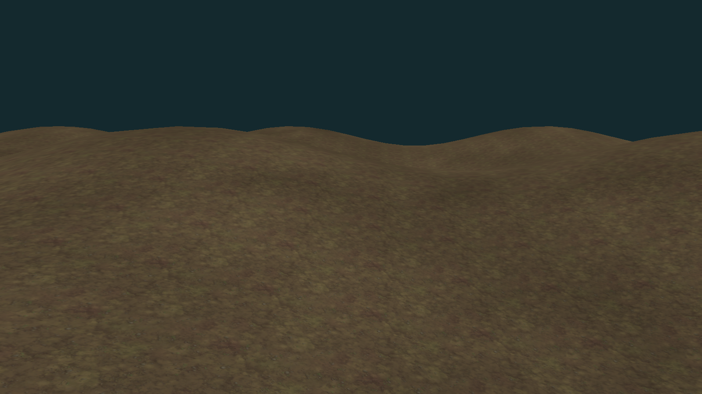

In this example, we create a ground plane from a grid of vertices and apply a texture to it. The texture is a 2D image that is mapped to the surface of the ground plane using texture coordinates. The texture coordinates are stored in the VBO along with the vertices of the ground plane.

This, mentally, isn't far more complex than the cube example, but we need to understand how to create a large area efficiently and produce the relationship between the vertices and the pairs of triangles forming the ground plane.

### mgl/ground_2 - Ground rendering with a 'height map' image

Rendering a simple ground plane with a texture and a height map from an image.

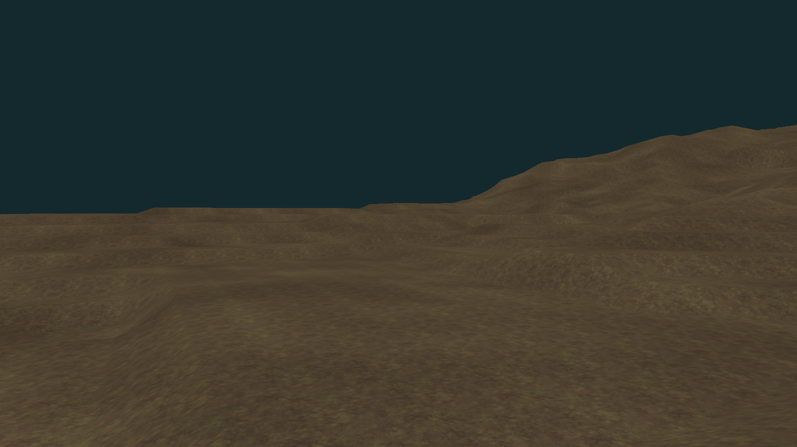

In practice, the height map could be procedurally generated or loaded from an image file. The height map is used to displace the vertices of the ground plane in the vertex shader, and this creates the effect of a 3D ground plane.

### mgl/ground_3 - Ground and grass rendering

I've combined several techniques to render the ground plane with a height map, and calculating normals for lighting. I added a global lighting model, and adding our local lights to the scene; and added a skybox.

This is a complex example that combines several techniques to render a realistic scene. The ground plane is created from a height map and displaced in the vertex shader. The normals of the ground plane are calculated in the geometry shader and passed to the fragment shader for lighting calculations.

The grass is created along each point on the ground plane using a geometry shader and a flow map to simulate wind movement. The grass fills the triangles, for now, but in a more complex scene later on I will create an interactive tool to paint the grass on the ground plane, by selecting the points and texture on the atlas to use.

In the case of large scenes, we need to use a 'chunk' system to load and unload parts of the scene as the camera moves around. This is because loading the entire scene into memory at once would be inefficient and slow. More on this later.

### mgl/ground_4 - Chunks + dynamic loading

<!-- Obviously the ground_3 demo is slow with a large height map, so I've added a chunk system to load and unload parts of the height map as the camera moves around. -->

<!--  -->

Not ready yet...

### mgl/parallel - Parallel processing

Not ready yet...

### mgl/water - Water rendering

Not ready yet...

### mgl/physics - Physics and collision detection

Not ready yet...

### mgl/terrain - Complete terrain scene

This is the final example of the ModernGL series and it will combining ground, grass, and water rendering to create a complete terrain scene; with shadows, skybox, and illumination.

It will feature collision detection and physics for the camera player, and a chunk system to load and unload parts of the scene as the camera moves around.

Of course, this is not ready yet...

### mgl/sdf_ray_marching - SDF 'ray marching'

We have explored in depth the classic mesh rendering techniques, but there is another way to render 3D shapes. This is a technique used to render complex 3D shapes using simple mathematical functions.

Following from the tutorials here: <https://www.youtube.com/watch?v=hUaYxqkrfjA> and <https://www.youtube.com/watch?v=i12pFwXlOGw>.

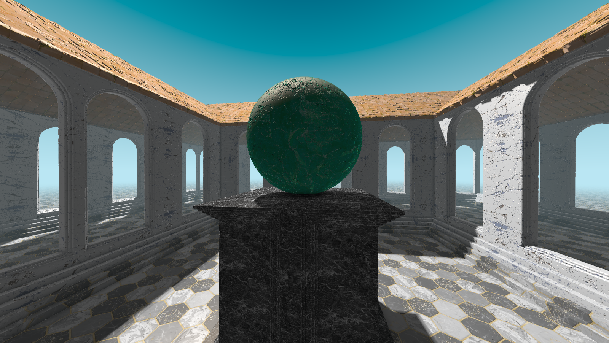

SDF is a technique used to render complex 3D shapes using simple mathematical functions. The basic idea is to define a function that returns the distance from a point in 3D space to the surface of the shape. This function is called a Signed Distance Function, and it is used to render the shape by 'marching' along the ray from the camera to the shape.

The SDF is used to calculate the distance from the camera to the shape, and then the color of the pixel is calculated based on the distance. This creates the effect of a 3D shape without the need for a 3D mesh.

In this example, we create a sphere using an SDF and render it using ray marching. We also create a building around the sphere using a box SDF and render it using ray marching. We add anti-aliasing, shadows, reflections, and bump mapping to the scene to make it more realistic.

## p3d - Panda3D demonstrations

My first test in **Panda3D** following the basic tutorial for minecraft style block rendering from <https://www.youtube.com/watch?v=xV3gH1JZew4>.

Here we load in textured block meshes from **.glb** model files, create a simple grid, add a skybox, and have simple camera with movement and controls to dig or place blocks with Ray collision detection.

I added better camera controls and some collision detection for the 'camera' player in my example.

To install use `pip install -r requirements.txt` to fetch the following packages:

-   panda3d==1.10.14
-   types-panda3d==0.4.1
-   panda3d-gltf==1.1.0

To run the example use `python main.py` from any of the project directories.

I have halted for now to work on ModernGL instead because I want to learn more about the 3D rendering process and the mathematics and data structures behind it.

<!-- ## ursina - Ursina 3D engine

Will be exploring the Ursina 3D engine soon, nothing here yet... -->
