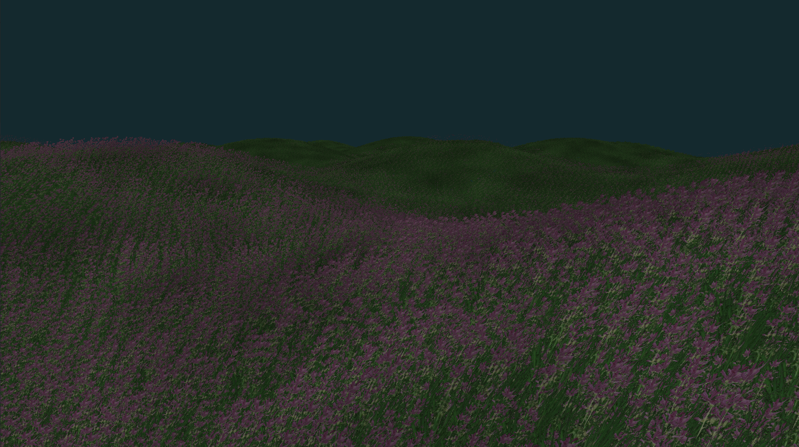
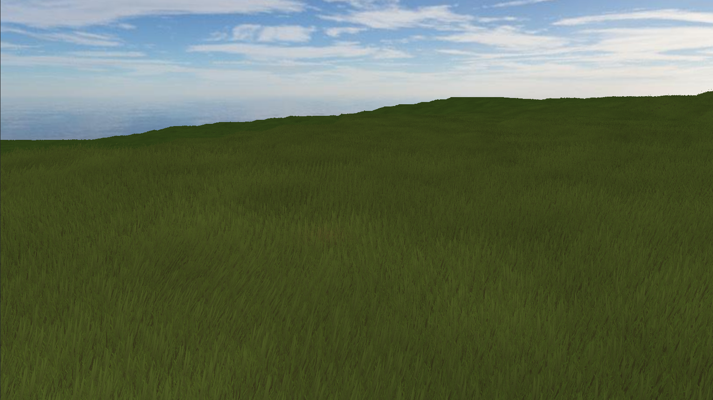

# Python 3D Rendering Engines

An exploration of 3D engines and rendering in Python by `Nokota Mustang`.

Computer graphics is a vast field, and I am interested in learning more about the rendering process and the mathematics behind it. Having a good grasp of realtime graphics, data structures, and algorithms is essential for game development, simulations, and visualizations. I've completed 2D game projects before, but I want to learn more about 3D graphics and rendering.

There is a lot of crossover to modern App development, and the skills learned here can be applied to AR/VR, simulations, and data visualization. In addition data processing and machine learning can benefit from the parallel processing capabilities of the GPU; so learning about graphics rendering is a good investment of time.

Opengl is a low-level graphics API that can be used to create 3D graphics, but it is quite complex and requires a lot of boilerplate code to get started. ModernGL is a Python wrapper around OpenGL that simplifies the process of creating 3D graphics.

There are several very large and detail books about graphics rendering, but when it comes to creating real-time graphics with interactive applications, there is a complex balance between performance and quality.

This means there are several ideas and solutions to some of the same problems, but the issue becomes how to combine multiple techniques to create a coherent and efficient system.

In the case if Disney's Panda3D, it is a game engine that simplifies the process of creating 3D games with c++ or Python. However usually when exploring a game engine, the low level rendering process is abstracted away, and an assortment of tools and features are provided, which also sometimes carries code-bloat and performance overhead. The bigger the engine, the more features and tools are available, but the more complex and harder to learn it becomes; such in the case of Unity or Unreal Engine 4 or 5.

Therefore to learn how to approach graphics from a first-principles perspective, I will be exploring Python based rendering engines. Why Python? Because it is a high-level language that is easy to learn and use, and it is also a language that I am familiar with and it's one of the most powerful and popular tools out there today. I also have a series that will explore c++ with Vulkan, but that is a different story.

How to use this repository? Each project is a standalone example of a 3D rendering technique or feature. Some projects are combined to create a more complex scene. Each project is a self-contained example that can be run independently.

All projects are working with Python 3.12.

## mgl - ModernGL and Pygame 3D demonstrations

To install use `pip install -r requirements.txt` to fetch the following packages:

-   moderngl==5.11.1
-   moderngl-window==2.4.6
-   pygame==2.6.0
-   PyGLM==2.7.1
-   numba==0.60.0
-   numpy==1.26.3
-   opensimplex==0.4.5.1
-   pywavefront==1.3.3

To run the example use `python main.py` from any of the project directories.

General keys in the examples:

-   `ESC` - Exit
-   `F1` - Pause time / Resume time
-   `F3` - Toggle view of wire-frames
-   `F11` - Toggle full screen
-   `WASD` - [Forward, Left, Backward, Right fly] camera movement

### mgl/cube - Cube with Lambert Diffusion & Blinn-Phong Specular lighting

Create a 3D cube from vertices, indices, and normals, and apply a simple lighting shader to it.

This is a basic example creating a 3D mesh from scratch and applying a simple shader program to it. The shader program is a combination of Lambert Diffusion and Blinn-Phong Specular lighting models.

Because we communicate with the GPU using OpenGL under the hood, we need to send data to the GPU in the form of buffers. We create a Vertex Buffer Object (VBO) to store the vertices, and an Element Buffer Object (EBO) to store the indices of the vertices that make up the triangles of the cube.

The shader program is a combination of a vertex shader and a fragment shader. The vertex shader is responsible for transforming the vertices of the cube into screen space, and the fragment shader is responsible for calculating the color of each pixel on the cube. These shaders are written in GLSL (OpenGL Shading Language) and operate in parallel on the GPU via thousands shader cores.

Therefore learning to write code in parallel is essential for creating efficient graphics applications.

### mgl/cube_2 - Anti-aliasing

Added anti-aliasing with a sized up render buffer with 4 samples.

### mgl/cubes - Cubes + textures

Adding more cubes to the scene with texture mapping and multiple light sources.

### mgl/cubes_2 - Cubes + textures + shadows

Added shadows to the cubes demo; this example also re-uses shaders and therefore shader program values are set for each object before rendering.

In an ideal situation, we would send all data in matrices to the shader, and then render all objects in one go with minimal value changes to the shader program.

Additionally, this uses a single shadow map for all objects in the scene i.e. only one light direction is modelled. Some changes are needed to support shadows from multiple light sources. If I code that, I will be adding global lighting as well.

### mgl/simple_scene - Combining simple features

The basic example use ModernGL following this tutorial from 'Coder Space': <https://www.youtube.com/watch?app=desktop&v=eJDIsFJN4OQ>. I've expanded on this adding more features, see below for the examples.

Using textured cubes, shader programs, skybox, lighting and shadows. This is the same as the original example from the tutorial, but refactored and I've added some object culling.

### mgl/pbr - Physically based rendering (PBR)

Using a PBR shader to render cubes with different materials and multiple light sources.

### mgl/grass - Grass rendering

Grass rendering using Geometry Shaders and bill boarding; and modelling wind movement using a flow map.

Starting from the tutorial: <https://vulpinii.github.io/tutorials/grass-modelisation/en/> and <https://developer.nvidia.com/gpugems/gpugems/part-i-natural-effects/chapter-7-rendering-countless-blades-waving-grass>.

Flow maps information and tools: <https://github.com/JaccomoLorenz/godot-flow-map-shader>

### mgl/grass_2 - Grass rendering from a texture atlas

Expanding on the grass rendering to use a texture atlas for the grass models.

_Just indexing manually right now in the geom shader; so I will add controls to select the grass type or I will extend to paint different grass types on the ground._

### mgl/ground - Ground rendering

Rendering a simple ground plane with a texture.

### mgl/ground_2 - Ground rendering with a 'height map'

Rendering a simple ground plane with a texture and a height map from an image.

### mgl/ground_3 - Ground and grass rendering

I've combined several techniques to render the ground plane with a height map, and calculating normals for lighting.

The grass is placed on the triangles of the ground plane, and so the grass moves with the ground heights.

I added a global lighting model, and adding our local lights to the scene; and added a skybox.

### mgl/ground_4 - Chunks + dynamic loading

<!-- Obviously the ground_3 demo is slow with a large height map, so I've added a chunk system to load and unload parts of the height map as the camera moves around. -->

<!--  -->

Not ready yet...

### mgl/water - Water rendering

Not ready yet...

### mgl/physics - Physics and collision detection

Not ready yet...

### mgl/terrain - Complete terrain rendering

<!-- Combining ground, grass, and water rendering to create a complete terrain scene; with shadows, skybox, and illumination. -->

Not ready yet...

### mgl/sdf_ray_marching - SDF 'ray marching' rendering

Following the tutorials: <https://www.youtube.com/watch?v=hUaYxqkrfjA> and <https://www.youtube.com/watch?v=i12pFwXlOGw>.

Building a simple scene using Signed Distance Functions (SDF) to render a sphere and building around it. The example extends to use AA, shadows, reflections, and bump mapping. Everything is contained in shader programs!

<!-- ### More Features To Add

Wish list for much later down the road includes the following:

-   Global and local illumination shapes
-   More model types (blender, gltf, etc)
-   Skeletal animation
-   Draw text to the screen
-   Reflections and refractions
-   Post Processing -->

## p3d - Panda3D demonstrations

My first test in **Panda3D** following the basic tutorial for minecraft style block rendering from <https://www.youtube.com/watch?v=xV3gH1JZew4>.

Load in textured block meshes from **.glb** model files, create a simple grid, add a skybox, and have simple camera with movement and controls to dig or place blocks with Ray collision detection.

I added better camera controls and some collision detection for the 'camera' player in my example.

To install use `pip install -r requirements.txt` to fetch the following packages:

-   panda3d==1.10.14
-   types-panda3d==0.4.1
-   panda3d-gltf==1.1.0

To run the example use `python main.py` from any of the project directories.

I have halted for now to work on ModernGL instead.

## ursina - Ursina 3D engine

Will be exploring the Ursina 3D engine soon, nothing here yet...
