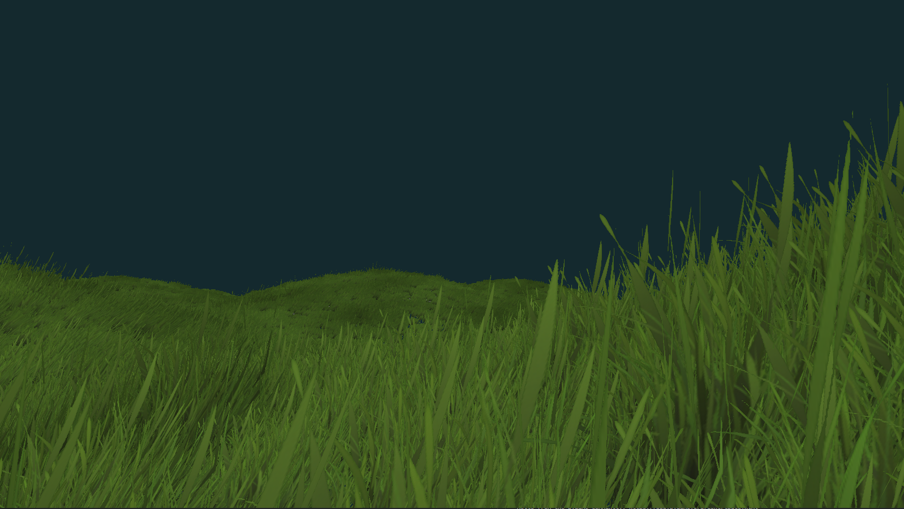

# Python 3D Rendering Engines

An exploration of 3D engines and rendering in Python by `Nokota Mustang`.

All projects are working with Python 3.12.

## ./mgl - ModernGL and Pygame

To install use `pip install -r requirements.txt` to fetch the following packages:

-   moderngl==5.11.1
-   pygame==2.6.0
-   PyGLM==2.7.1
-   numba==0.60.0
-   numpy==1.26.3
-   opensimplex==0.4.5.1
-   pywavefront==1.3.3

To run the example use `python main.py` from any of the project directories.

The basic example use ModernGL following this tutorial <https://www.youtube.com/watch?app=desktop&v=eJDIsFJN4OQ>. I've expanded on this adding more features, see below for the examples.

### ./mgl/cube/ - Cube with Lambert Diffusion & Blinn-Phong Specular Lighting

We create a 3D cube from vertices, indices, and normals, and apply a simple lighting shader to it. We also have a first person camera with movement and controls using `WASD` and mouse for looking around.

### ./mgl/cubes/ - Cubes + Textures

Adding more cubes to the scene with texture mapping and multiple light sources.

### ./mgl/pbr/ - Physically Based Rendering

Using a PBR shader to render cubes with different materials and multiple light sources.

### ./mgl/grass/ - Grass rendering

Grass rendering using Geometry Shaders and bill boarding; and modelling wind movement using a flow map.

Starting from the tutorial: <https://vulpinii.github.io/tutorials/grass-modelisation/en/> and <https://developer.nvidia.com/gpugems/gpugems/part-i-natural-effects/chapter-7-rendering-countless-blades-waving-grass>.

Flow maps information and tools: <https://github.com/JaccomoLorenz/godot-flow-map-shader>

### ./mgl/water/ - Water rendering

Working on this example...

### ./mgl/physics - Physics and Collision Detection

Working on this example...

### ./mgl/complex_scene/ - Combining all current features

Textured cubes, shader programs, skybox, lighting and shadows. This is the same as the original example from the tutorial, but refactored and object culling added.

### More Features To Add

Wish list includes:

-   Global and local illumination shapes
-   More model types (blender, gltf, etc)
-   Skeletal animation
-   Draw text to the screen
-   Reflections and refractions
-   Post Processing
-   Anti-aliasing

## ./p3d - Panda3D

My first test in **Panda3D** following the basic tutorial for minecraft style block rendering from <https://www.youtube.com/watch?v=xV3gH1JZew4>.

We load in textured block meshes from **.glb** model files, create a simple grid, add a skybox, and have simple camera with movement and controls to dig or place blocks with Ray collision detection.

I added better camera controls and some collision detection for the 'camera' player in my example.

To install use `pip install -r requirements.txt` to fetch the following packages:

-   panda3d==1.10.14
-   types-panda3d==0.4.1
-   panda3d-gltf==1.1.0

To run the example use `python main.py` from any of the project directories.

I have halted for now to work on ModernGL instead.
